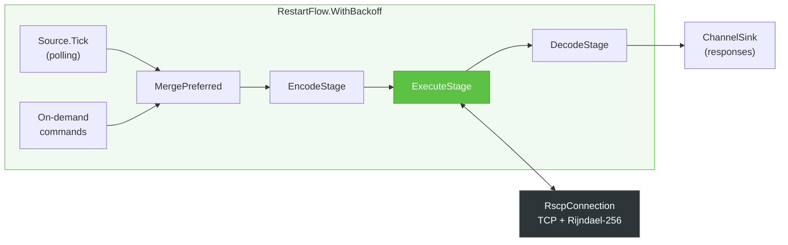
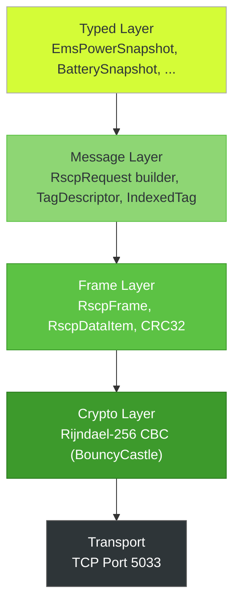

# Architecture

The e3dc-connector library is structured in layers, each with clear responsibilities.

## System Context

The library sits between your application and the E3DC S10 Pro hardware, handling all protocol complexity.

## Akka.Streams Pipeline

Internally, commands flow through an Akka.Streams pipeline that handles serialization, TCP communication with Rijndael-256 encryption, and deserialization. `RestartFlow.WithBackoff` provides automatic reconnection with exponential backoff.

## Protocol Layers

The encoding stack from typed .NET records down to encrypted TCP bytes:

| Layer | Component | Responsibility |
|-------|-----------|----------------|
| **Typed** | `EmsPowerSnapshot`, `BatterySnapshot`, ... | Strongly-typed .NET records |
| **Messages** | `RscpRequest` builder, `TagDescriptor`, `IndexedTag` | Fluent request composition with compile-time safety |
| **Frame** | `RscpFrame`, `RscpDataItem` | Binary TLV encoding + CRC32 |
| **Crypto** | `RscpCrypt` | Rijndael-256 CBC encryption (BouncyCastle) |
| **Transport** | `RscpConnection` | TCP socket on port 5033 |

## Key Patterns

**Compile-time safety:** Tag descriptors use the type system to prevent misuse. `TagDescriptor` for top-level tags (EMS, INFO, EP), `IndexedTag` for device sub-tags (PVI, BAT, PM, WB) that must be inside `FromDevice()`. Passing an `IndexedTag` to `.Read()` is a compile error.

**Fluent builder:** `RscpRequest.Create()` chains `.Read()`, `.Write()`, `.FromDevice()`, and `.Container()` to compose arbitrarily complex RSCP frames.

**Correlation-based request-reply:** Every command gets a `CorrelationId`. The `RscpClient` stores a `TaskCompletionSource` in a `ConcurrentDictionary`, which is completed when the matching response arrives.

**Channel bridging:** Commands flow through a bounded `Channel<IRscpCommand>` (capacity 256), responses through an unbounded `Channel<IRscpMessage>`. The Akka.Streams flow runs independently in the background.

**Automatic reconnection:** The entire inner flow is wrapped in `RestartFlow.WithBackoff` (1s-30s exponential backoff, 20% jitter). On restart, a new TCP connection is established and authentication is re-executed.

## LikeC4 Source

The architecture is also modeled in LikeC4 in `docs/architecture/likec4/`:
- `model.c4` — elements and relationships
- `views.c4` — diagram views
