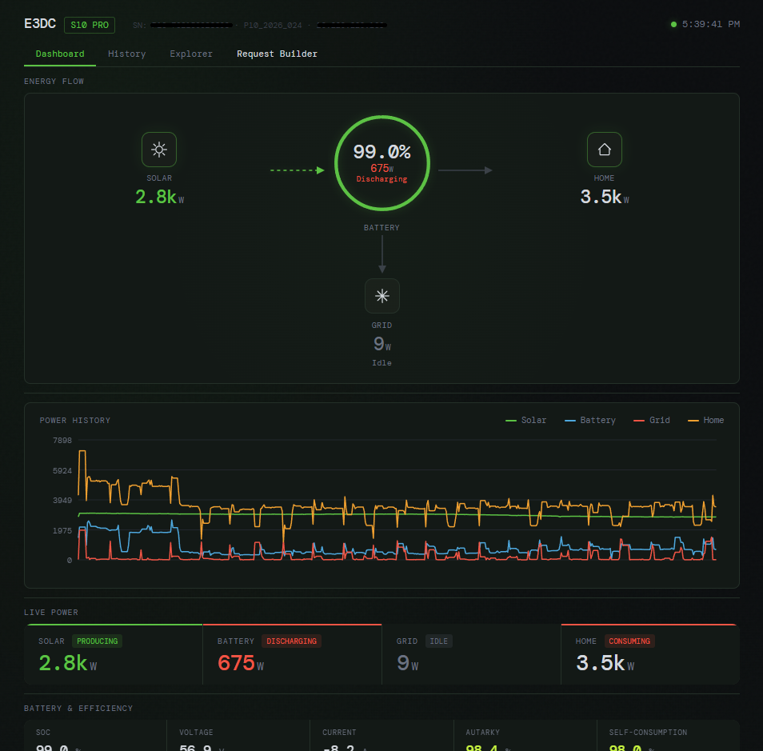
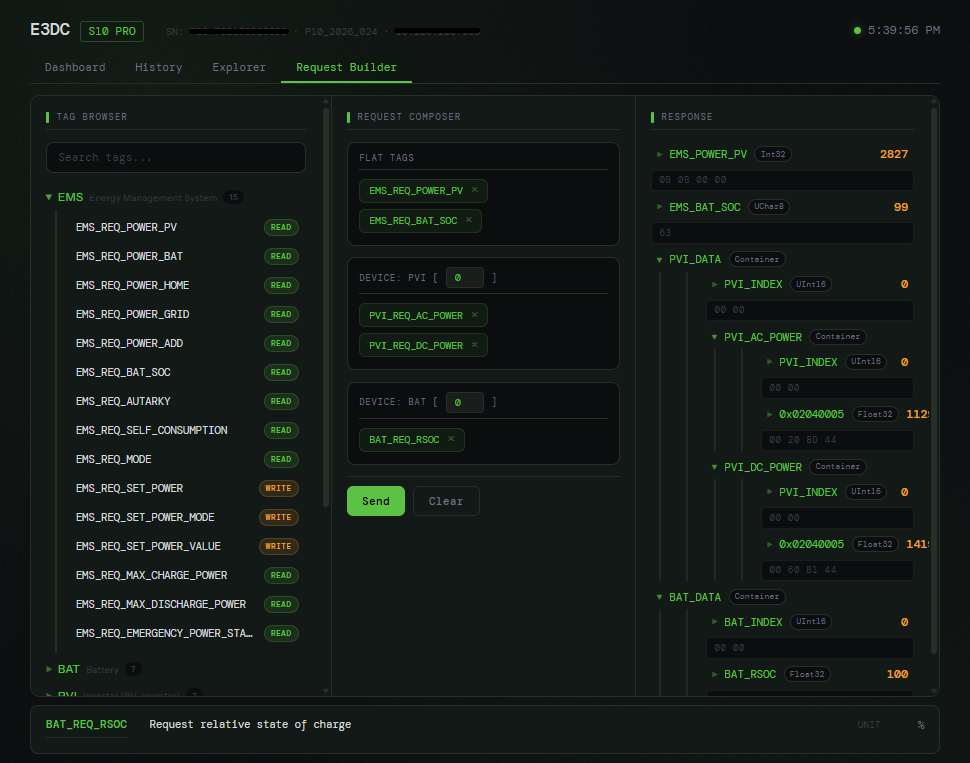

## What is this?

E3DC.NET is a .NET library that communicates with [E3DC](https://www.e3dc.com/) S10 home battery systems using the proprietary **RSCP** (Remote Storage Control Protocol). At least the S10 is the one that is tested. It gives you direct, local access to your energy system — no cloud dependency.

## Quick Example

```csharp
using E3dc;

var request = RscpRequest.Create()
    .Read(Ems.PowerPv, Ems.PowerBat, Ems.PowerGrid, Ems.PowerHome)
    .Read(Ems.BatSoc);

// ... send via RscpFlow or RscpClient, then:
var ems = response.ToEmsPowerSnapshot();
Console.WriteLine($"Solar: {ems.PvWatts}W, Battery: {ems.Soc}%");
```

## Dashboard

The included sample dashboard is a full demonstrator of the RSCP protocol, which you can just use and enjoy, or use as inspiration and modify it to your liking. 





If you want to use it as it, a container image is available at:
``` shell
docker pull ghcr.io/leberkas-org/e3dc-dashboard:latest
```