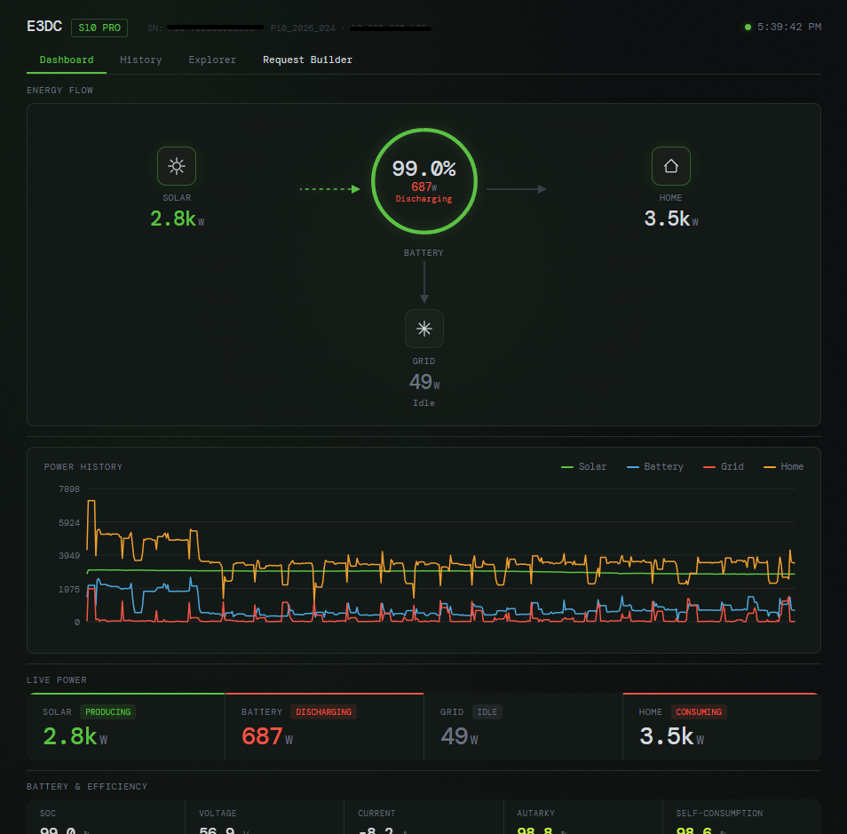
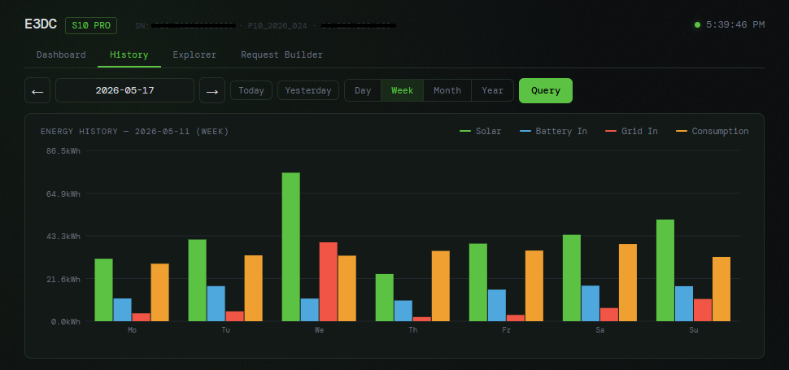
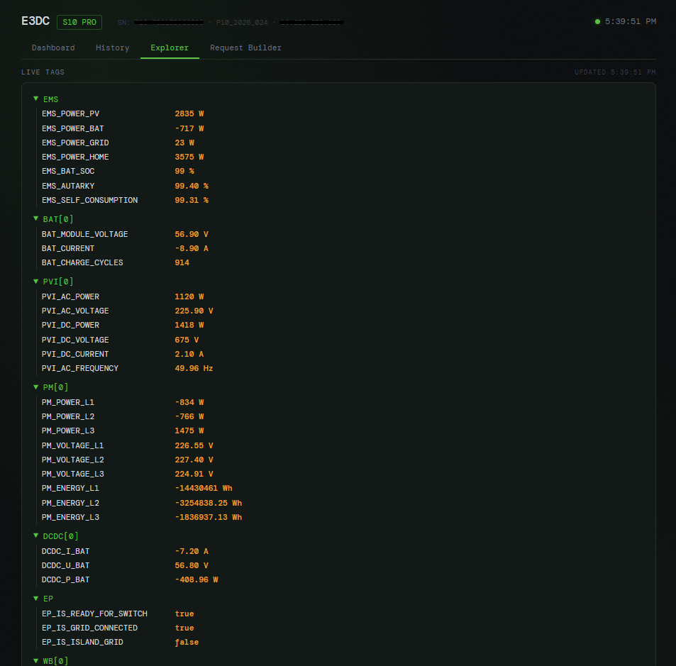

# E3DC Dashboard

A full ASP.NET Core web application that demonstrates the E3DC RSCP connector library. It provides a live dashboard for an E3DC S10 home energy storage system with a 4-tab dark-themed UI.

## Screenshots

### Dashboard



### History


### Explorer


### Request Builder


---

## Architecture

### Actor System

Three Akka.NET actors handle all RSCP interaction:

| Actor | Responsibility |
|---|---|
| **SnapshotActor** | Owns all dashboard state: latest snapshot, history ring buffer, device info |
| **RscpGatewayActor** | Wraps the RSCP Akka.Streams flow, provides a command channel and response routing for ad-hoc requests |
| **PollingActor** | Manages tiered polling lifecycle using Akka Scheduler; tracks connected browser count |

### Polling Tiers

| Tier | Frequency | Tags | Trigger |
|---|---|---|---|
| Startup | Once on connect | INFO (serial, SW version, IP), EP status | Always |
| Fast | `FastPollingIntervalSeconds` (default 2 s) | EMS power flows, BAT SOC | Always |
| Medium | `MediumPollingIntervalSeconds` (default 10 s) | PVI, PM, BAT details, DCDC, WB | Only while a browser is connected via SSE |

Medium polling activates when the first SSE client connects and stops when the last one disconnects. This avoids unnecessary traffic when the dashboard is not open.

### API

The OpenAPI contract is defined in `openapi.yaml`. NSwag generates controller base classes (`DashboardControllerBase`, `RscpControllerBase`, `DiagnosticsControllerBase`) which the hand-written controllers implement. Controllers resolve actors via `ActorRegistry` and communicate with them using the Ask pattern.

The SSE stream endpoint (`GET /api/stream`) is a minimal API registered directly in `Program.cs` — it is intentionally outside the OpenAPI contract because SSE cannot be described usefully in OpenAPI.

Swagger UI is available at `/swagger`.

### Frontend

A single-page application with an ES module architecture served as static files from `wwwroot/`:

| File | Purpose |
|---|---|
| `index.html` | HTML shell, tab structure |
| `css/style.css` | All styling (dark theme) |
| `js/app.js` | Entry point — SSE connection, tab switching |
| `js/dashboard.js` | Energy flow schematic, power history chart, live tile updates |
| `js/history.js` | Flatpickr date picker, history queries, bar chart |
| `js/explorer.js` | Live RSCP tag tree |
| `js/builder.js` | 3-panel RSCP protocol workbench |
| `js/utils.js` | Shared helpers |
| `js/rscp-tags.json` | Tag knowledge base with descriptions |

---

## Tabs

### Dashboard

Energy flow schematic showing Solar → Battery → Home with Grid below. Animated SVG pipes indicate the direction and magnitude of power flows. A radial battery gauge shows state of charge. Below the schematic, a scrollable power history chart shows recent watts over time.

Live tile sections cover:
- Battery & Efficiency
- Inverter (PVI)
- Grid Meter (PM)
- DC Converter (DCDC)
- Emergency Power (EP)
- Wallbox (WB)
- System controls

### History

Query historical energy data stored on the E3DC device by day, week, month, or year. A Flatpickr date picker with arrow navigation selects the time range. A bar chart displays Solar, Battery In, Grid In, and Consumption per interval.

### Explorer

A live tag tree showing all currently polled RSCP data, grouped by namespace: EMS, BAT[0], PVI[0], PM[0], DCDC[0], EP, WB[0]. The tree updates automatically on every SSE tick.

### Request Builder

A 3-panel RSCP protocol workbench for exploring and testing arbitrary RSCP requests:

- **Tag Browser** (left) — searchable tag tree with descriptions and READ/WRITE badges
- **Request Composer** (center) — build request frames with mixed namespaces and device indices
- **Response Viewer** (right) — structured response tree with parsed values and raw hex

---

## Configuration

`appsettings.json` (or environment variables for Docker):

```json
{
  "E3DC": {
    "Host": "192.168.1.100",
    "User": "your-e3dc-portal-email",
    "Password": "your-e3dc-portal-password",
    "RscpKey": "your-rscp-encryption-key",
    "FastPollingIntervalSeconds": 2,
    "MediumPollingIntervalSeconds": 10,
    "HistoryRetentionMinutes": 60,
    "BatDeviceIndex": 0,
    "PviDeviceIndex": 0,
    "PmDeviceIndex": 6,
    "DcdcDeviceIndex": 0,
    "WbDeviceIndex": 0
  }
}
```

| Field | Description |
|---|---|
| `Host` | IP address of the E3DC device on your local network |
| `User` | E3DC portal email address (used for RSCP authentication) |
| `Password` | E3DC portal password |
| `RscpKey` | RSCP encryption key set on the device (Settings → Personalize → RSCP password) |
| `FastPollingIntervalSeconds` | Interval for EMS/BAT SOC polling and SSE push cadence |
| `MediumPollingIntervalSeconds` | Interval for PVI/PM/BAT detail/DCDC/WB polling (active only while browser connected) |
| `HistoryRetentionMinutes` | How many minutes of fast-poll history to keep in the in-memory ring buffer |
| `BatDeviceIndex` | Device index for the battery (usually 0) |
| `PviDeviceIndex` | Device index for the PV inverter (usually 0) |
| `PmDeviceIndex` | Device index for the power meter (commonly 6 for the grid meter) |
| `DcdcDeviceIndex` | Device index for the DC-DC converter (usually 0) |
| `WbDeviceIndex` | Device index for the wallbox (usually 0) |

---

## Running

### Local

```bash
dotnet run --project samples/E3dc.Dashboard
# Open http://localhost:5000
```

Edit `samples/E3dc.Dashboard/appsettings.json` with your connection details before starting.

### Docker

```bash
cd samples
cp .env.example .env   # then edit .env with your credentials
docker compose up -d --build
# Open http://localhost:15000
```

The `.env` file uses double-underscore notation for nested configuration keys:

```env
E3DC__Host=192.168.1.100
E3DC__User=your-portal-email
E3DC__Password=your-portal-password
E3DC__RscpKey=your-rscp-key
```

Polling intervals and device indices default to the values in `appsettings.json` and can be overridden the same way (e.g. `E3DC__PmDeviceIndex=6`).

---

## API Endpoints

| Method | Path | Description |
|---|---|---|
| GET | `/api/stream` | SSE real-time data stream (pushes snapshot on each fast-poll tick) |
| GET | `/api/history` | In-memory history ring buffer as JSON |
| GET | `/api/info` | Cached device info (serial, SW version, IP) |
| GET | `/api/tags` | All currently polled RSCP tags grouped by namespace |
| GET | `/api/debug` | Raw RSCP tag dump |
| GET | `/api/diag` | Internal diagnostic state of actors and polling tiers |
| POST | `/api/send` | Send an ad-hoc RSCP request and return the parsed response |
| POST | `/api/history-query` | Query historical energy data from the E3DC device |
| GET | `/swagger` | Swagger UI (contract from `openapi.yaml`) |
